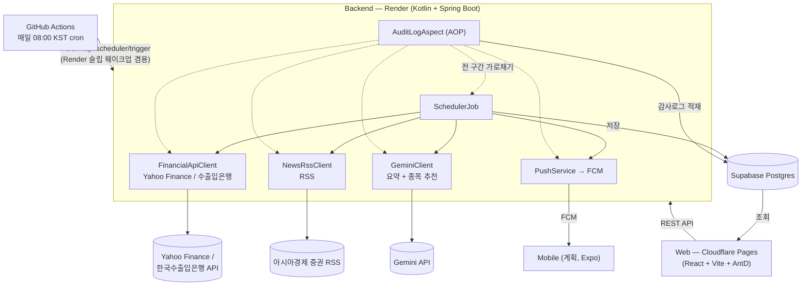

# FireWatch 🔥

매일 아침 8시, 국내/미국 증시 요약·호재/악재 뉴스·금/은 시세·환율(USD·JPY·CNY)을 자동 수집·분석해 웹 대시보드와 모바일 푸시(FCM)로 전달하는 시스템이다. 스케줄러·AI 호출·푸시 발송 전 과정을 **감사로그(Audit Log)**로 남겨 "오늘 브리핑이 왜 이런 모양인지"를 이벤트 단위로 추적할 수 있게 한 것이 이 프로젝트의 핵심 차별점이다.

- **웹 대시보드**: https://firewatch-eqp.pages.dev
- **백엔드 API**: https://firewatch-backend-q3cv.onrender.com (무료 티어, 15분 무활동 시 슬립)

## 목차

- [아키텍처](#아키텍처)
- [기술 스택과 선택 이유](#기술-스택과-선택-이유)
- [요구사항과 문제 해결](#요구사항과-문제-해결)
- [상태 관리](#상태-관리)
- [성능 최적화](#성능-최적화)
- [품질 개선](#품질-개선)
- [배포 방법](#배포-방법)
- [운영 이슈 대응](#운영-이슈-대응)
- [AI로 구축한 방식](#ai로-구축한-방식)

## 아키텍처

세 서비스(`backend/`, `web/`, `mobile/`) 중 backend·web은 배포 완료 상태이고, mobile은 스캐폴딩 전이다. 감사로그는 `AuditLogAspect`가 스케줄러·외부 API 호출·푸시 발송을 전부 가로채 `SUCCESS`/`WARNING`/`FALLBACK`/`FAILURE` 4개 상태 중 하나로 자동 기록한다 — 어느 코드에도 로깅 코드를 직접 흩뿌리지 않는다.

## 기술 스택과 선택 이유

| 계층 | 스택 | 선택 이유 |
|---|---|---|
| Backend | Kotlin 2.3 + Spring Boot 4.1 + WebFlux | Null 안정성과 간결한 문법이 스케줄러의 안정적 반복 실행에 유리하다고 판단해 원본 명세서가 지정 |
| 감사로그 | Spring AOP + Logback + JPA | 비즈니스 로직에 로깅 코드를 섞지 않고 외부 API 호출 지점만 가로채 자동 기록 |
| Web | React 18 + Vite + Ant Design v5 | 대시보드 요구사항(FR-04/FR-07)이 이미 `Statistic`/`Card`/`Table`/`Timeline`/`Tag` 등 AntD 기본 제공 컴포넌트를 그대로 요구해, 1인 개발에서 직접 조립하는 비용을 아꼈다 |
| DB | Supabase Postgres (운영) / H2 (로컬) | Render 무료 티어가 영구 디스크를 제공하지 않아 슬립→재기동만으로 데이터가 초기화되는 걸 실제로 겪은 뒤 전환 |
| Backend 호스팅 | Render 무료 플랜 | Oracle Cloud Always Free Tier 가입이 본인인증 단계에서 막혀 카드 등록 불필요한 대안으로 전환 |
| Web 호스팅 | Cloudflare Pages | 월 $0 하드 제약(카드 등록 불가) 안에서 무료로 정적 사이트를 배포할 수 있어 원본 명세서가 지정 |
| 스케줄 트리거 | GitHub Actions cron | Render가 15분 무활동 시 슬립하므로 내부 `@Scheduled`만으로는 08:00 실행을 보장할 수 없어, 외부에서 API를 호출해 깨우는 방식으로 보완 |
| AI | Gemini API | 일 1,500회 무료 티어가 월 $0 제약과 맞아 채택했으나, 실제로는 grounding 없이 이미 확보한 데이터를 요약·해설하는 용도로 한정 (아래 문제 해결 참고) |
| 금융 데이터 | Yahoo Finance / 한국수출입은행 API | 둘 다 무료 — Yahoo는 비공식 엔드포인트라 가입 자체가 불필요하고, 수출입은행은 카드 등록 없이 API 키만 발급하면 된다 |

상세 근거는 각 결정을 ADR로 남긴 `llm-wiki/Decisions/`에 있다.

## 요구사항과 문제 해결

원본 명세서(`docs/specs/`)가 요구한 것은 "매일 자동으로 시세·뉴스를 수집해 AI로 요약하고, 실패해도 서비스가 죽지 않게 감사로그로 추적 가능한 시스템"이었다. 구현·운영 과정에서 마주친 문제 중 원인 분석이나 방향 전환이 필요했던 것들을 정리한다.

### 1. Kotlin 제네릭 검증 애노테이션이 조용히 무효였던 버그

`SettingsUpdateRequest.watchedStocks: List<@Pattern(...) String>` 형태로 관심종목 티커 형식을 검증한다고 생각했는데, 배포 후 API를 직접 호출해보니 `"반도체"` 같은 임의 문자열이 그대로 200 OK로 저장되고 있었다. 원인은 Kotlin의 제네릭 타입-인자 애노테이션이 Jakarta Bean Validation의 `TYPE_USE` 검증 대상으로 온전히 인식되지 않는 것 — 프레임워크가 조용히 검증을 건너뛰는 케이스였다. DTO의 애노테이션 방식을 걷어내고 서비스 레이어에서 정규식으로 직접 검사해 `400 VALIDATION_ERROR`를 던지도록 수정했다.

### 2. AuditContext ThreadLocal이 엉뚱한 호출에 소비되던 버그

감사로그를 실측 점검하던 중 `NEWS_API` 이벤트가 `FALLBACK` 상태에 "Gemini 실패: 429" 사유가 붙어 있는 걸 발견했다. Gemini와 전혀 무관한 뉴스 조회가 왜 그 사유를 뒤집어썼는지 추적한 결과, `AuditContext.fallbackReason`이 단순 `ThreadLocal<String?>`이라 "가장 바깥쪽 호출을 FALLBACK으로 표시하려는 의도"가 같은 스레드에서 실행되는 **아무 감사 대상 호출이나** 먼저 소비해버리는 구조적 결함이었다. 이전에는 `FCM_PUSH`가, 이번엔 새로 추가된 `NEWS_API`가 우연히 그 사이에 끼어 가로챈 것 — 즉 SCHEDULER 이벤트 자체는 FALLBACK 상태를 한 번도 정확히 남긴 적이 없었다. 스레드별 호출 깊이(`callDepth`)를 추가해 최상위(root) 호출만 이 표시를 소비하도록 고쳤고, 중첩 호출/최상위 각각의 케이스를 테스트로 고정했다.

### 3. 타임존 미지정으로 매일 스킵될 뻔한 스케줄러 버그

Gemini 수정을 검증하려고 수동 트리거했는데 계속 "오늘자 브리핑이 이미 존재해 스킵"이 떴다. `SchedulerJob`의 `LocalDate.now()`가 타임존을 지정하지 않아 컨테이너 기본값(UTC)을 썼던 게 원인 — `@Scheduled` cron 자체는 `Asia/Seoul`로 정확히 08:00에 돌지만, 그 안의 날짜 계산은 별개로 UTC를 썼다. KST 08:00은 UTC로 전날 23:00이므로, 이 버그를 그대로 뒀다면 **매일 자동 실행마다 "오늘"이 하루 전으로 계산돼 매번 스킵**되는 구조였다. `ZoneId`를 명시 주입해 해결했다.

### 4. 한국수출입은행 API가 항상 빈 배열을 반환하던 버그

API 문서의 "영업일 11시 이전에 당일 데이터를 요청하면 null 반환" 정책을 놓쳤다 — 스케줄러가 08:00(11시 이전)에 도니 항상 빈 응답을 받는 구조였다. 전일부터 최대 7일 거꾸로 조회해 데이터가 있는 가장 최근 영업일을 찾도록 수정했다.

### 5. Gemini 무료 티어의 Search Grounding 할당량이 사실상 0건

429 에러의 원인을 Google AI Studio 쿼터 화면에서 직접 확인한 결과, Gemini 3 계열 전체가 무료 티어에서 Search Grounding 도구 자체의 일일 할당량이 0건이었다 — "너무 많이 써서"가 아니라 "애초에 안 되는" 구조. 대안 모델(2.5-flash)도 세대 전환 중 조기 404. **이 프로젝트는 이미 Yahoo/수출입은행 시세와 RSS 뉴스로 실제 데이터를 확보하고 있어 Gemini가 굳이 스스로 웹 검색을 할 필요가 없다**는 점에 착안해, `tools` 필드(grounding)를 완전히 제거하고 대신 확보한 수치·뉴스를 프롬프트에 직접 넣어 "이미 가진 데이터를 요약·해설"하는 역할로 전환했다.

### 6. 뉴스 API 2연속 좌절 → 무료 대안으로 방향 전환

"관련 뉴스를 클릭해서 볼 수 있게" 하려고 네이버 검색 오픈API를 먼저 채택하려 했으나, 실제 애플리케이션 등록 화면에 "검색" API 항목 자체가 사라져 있었다 — 조사해보니 네이버가 검색 오픈API를 신규 플랫폼(NAVER API HUB)으로 이전 중이라 기존 채널의 신규 신청이 막혀 있었다. 대안으로 검토한 Google Custom Search API도 카드 등록 여부가 불확실해 보류했다. 두 유료 연동 가능성이 있는 API 후보를 모두 접고, 카드 등록이 전혀 필요 없는 **RSS 피드**로 최종 구현했다(XXE 방지 파싱 포함).

## 상태 관리

전역 상태 관리 라이브러리는 쓰지 않는다. 화면별 데이터 조회는 `useWatchlistSummary`, `useStockHistory` 같은 커스텀 훅이 `fetch` + `useState`/`useEffect`로 API를 호출하고 로딩/에러 상태를 캡슐화하는 패턴을 따른다. 브리핑·감사로그·시세 같은 서버 상태는 저장·조회를 모두 서버가 담당하고("서버가 정본, 웹은 받은 걸 그대로 그림" 원칙) 웹은 화면 진입 시점에 조회만 하므로, 클라이언트 캐싱이나 낙관적 업데이트가 필요한 복잡한 상호작용이 없어 별도 상태관리 라이브러리 도입의 실익이 없다고 판단했다.

## 성능 최적화

대시보드 로딩이 느리다는 지적을 받고 추측 대신 실측으로 원인을 셋으로 분리했다.

1. **Render 콜드스타트**(첫 요청 9초, 직후 요청 0.4초, 오래 쉬면 50초+) — 무료 티어 트레이드오프라 코드로 해결 불가.
2. **Pretendard 폰트 CDN 13개 파일** — 처음엔 문제로 짚었으나, 실제 바이트 수를 재보니 현재 방식(다이나믹 서브셋 13개 합계 359KB)이 통짜 가변폰트 파일 하나(2MB, 5.6배)보다 오히려 효율적이라는 걸 확인해 손대지 않기로 정정했다.
3. **JS 번들 1.6MB(gzip 495KB) 단일 파일** — 실제 개선 여지가 있어 `React.lazy`로 감사로그·종목·설정 페이지를 라우트 진입 시점에만 로드하도록 코드 스플리팅. 대시보드 초기 로드가 gzip 495KB → 약 371KB로 감소.

## 품질 개선

- **AOP 기반 감사로그**: 비즈니스 로직에 로깅 코드를 흩뿌리지 않고 관측 가능성을 확보 — 위 "문제 해결" 섹션의 버그 2(ThreadLocal 오귀속)는 이 감사로그를 실측 점검하다 발견됐다.
- **Postgres 전환 시 드러난 null 타입 추론 버그**: H2에서는 문제없던 `AuditLogRepository`의 JPQL `(:param IS NULL OR ...)` 패턴이 Postgres에서 파라미터 타입을 못 정해 500을 냈다 — `Specification` 기반으로 교체해 필터가 있을 때만 predicate를 추가하는 방식으로 근본 해결.
- **입력 검증**: 프론트(정규식 즉시 검증) + 백엔드(서비스 레이어 재검증) 이중화 — 위 버그 1이 "프론트만 검증하고 백엔드는 무효였던" 사례라 재발 방지 차원에서 양쪽 다 확인.

## 배포 방법

무료 등급 조합(카드 등록 불필요): **Render(백엔드) + Supabase(DB) + Cloudflare Pages(웹) + GitHub Actions(스케줄러 트리거)**. 상세 단계는 [`DEPLOY.md`](./DEPLOY.md) 참고.

1. Supabase에 Postgres 프로젝트 생성 (Render는 영구 디스크가 없어 외부 DB 필수)
2. Render에서 `render.yaml`(Blueprint)로 백엔드 배포, 환경변수(`GEMINI_API_KEY`, `EXIM_API_KEY`, `FIREBASE_SERVICE_ACCOUNT_JSON`, DB 접속정보 등) 입력
3. `wrangler pages deploy`로 웹을 Cloudflare Pages에 배포, `VITE_API_BASE_URL`을 실제 백엔드 URL로 설정
4. GitHub Actions 워크플로(`.github/workflows/daily-trigger.yml`)가 매일 08:00 KST에 `/api/scheduler/trigger`를 호출해 슬립 중인 백엔드를 깨우고 파이프라인을 실행

## 운영 이슈 대응

- **배포 직후 데이터 유실 사고**: Render 무료 티어가 슬립→재기동 사이클마다 컨테이너 파일시스템을 새로 띄운다는 걸 실제로 겪었다(전날 감사로그·브리핑이 전부 사라짐). 감사로그가 이 프로젝트의 핵심 가치라 감수할 리스크가 아니라 판단해, `SPRING_PROFILES_ACTIVE=prod` 분기로 로컬(H2)은 그대로 두고 운영만 즉시 Supabase Postgres로 전환했다.
- **첫 실서비스 아침 실행 점검**: 자동 실행 직후 감사로그를 직접 조회해 Gemini 429·타임존·수출입은행 11시 정책 버그 3개를 한 번에 발견·수정했다(위 "문제 해결" 참고) — 배포됐다고 끝이 아니라 첫 라이브 실행 결과를 실측하는 과정에서 나온 것들이다.
- **GitHub Actions 스케줄 타임아웃**: 자동 실행이 `curl --max-time 120` 초과로 실패한 사례를 `gh run view --log`로 확인 — 재배포와 겹친 콜드스타트가 원인으로 추정되며, 반복되면 워크플로 타임아웃을 늘리는 걸 재검토하기로 했다.

## AI로 구축한 방식

이 프로젝트는 Claude Code로 개발했다. AI에게 코드를 맡기고 끝낸 게 아니라, **세션이 끊겨도 맥락이 유지되고 AI가 스스로 기록을 남기도록 강제하는 협업 체계(`llm-wiki/`)를 직접 설계·운영**한 것이 이 프로젝트에서 실제로 얻은 AI 활용 역량이다.

### 세션 간 기억을 코드처럼 버전 관리

Claude Code는 대화가 끝나면 맥락을 잃는다. 이를 "AI가 매번 새로 파악해야 하는 문제"로 두지 않고, 코드와 함께 커밋되는 3종 문서로 구조화했다.

- **`Context.md`**: "지금 무엇을 만드는가"를 한 장으로 유지하는 현재 상태 스냅샷. 이력이 아니라 최신 상태만 담아 매 세션 첫 진입점으로 쓴다.
- **`Decisions/0001~0011`**: 기술적 판단마다 맥락·결정·근거·트레이드오프·재검토 조건을 ADR로 남긴다. 예를 들어 "Oracle Cloud 대신 Render", "H2에서 Supabase로 전환" 같은 결정은 왜 그렇게 했는지가 코드만 봐서는 사라지는 정보인데, 이걸 남겨두면 다음 세션이 같은 조사를 반복하지 않는다.
- **`log.md`**: 날짜별 세션 로그. 위 "문제 해결" 섹션에 쓴 서술은 전부 실제 작업 중 여기에 기록된 원문에서 가져온 것이다.

### AI에게 규율을 강제하는 훅

"기록을 남기자"는 다짐만으로는 지켜지지 않는다는 걸 알기 때문에, `.claude/settings.json`에 두 훅을 걸어 시스템이 강제하게 했다.

- **SessionStart 훅**: 세션이 시작되면 `log.md`의 최신 날짜 섹션과 `Next-Tasks.md`의 열린 과제(BE/WEB/APP 접두사로 파싱)를 셸 스크립트로 추출해 AI 컨텍스트에 자동 주입한다. 사람이 "저번에 뭐 했었지" 설명할 필요가 없다.
- **Stop 훅**: 세션 종료 시 코드 변경이 있는데 오늘 날짜로 `log.md`에 기록이 없으면 **exit 2로 세션 종료 자체를 막는다.** "일단 코드만 짜고 기록은 나중에"라는, AI 협업에서 가장 흔히 새는 지점을 도구 레벨에서 봉쇄한 것이다.

### 범용 AI 템플릿을 그대로 받아들이지 않은 판단

bkit(Claude Code PDCA 플러그인)의 Enterprise 스킬은 기본적으로 Turborepo + FastAPI + K8s/Terraform 템플릿을 `init`한다. 이 프로젝트는 이미 완성된 명세서 3종(`docs/specs/`)이 계층별 스택과 아키텍처를 구체적으로 지정하고 있었기 때문에, 그 기본 템플릿을 그대로 받아들이면 명세서와 정면충돌한다는 걸 먼저 확인하고 **의도적으로 `init`을 실행하지 않았다**(ADR 0001). bkit은 PDCA 문서 워크플로만 골라 쓰고, 기술 스택은 원본 명세서를 정본으로 유지했다 — AI 도구가 기본 제공하는 것을 그대로 따르지 않고, 이 프로젝트에 맞는지 먼저 판단한 사례다.

### 검증 우선 원칙

세션 운영 원칙은 "AI가 그럴듯한 이유를 대면 그대로 믿지 않는다"였다. 폰트 CDN이 로딩 속도 문제라고 짚었다가 실제 바이트 수를 재보고 정정한 사례, Gemini 429의 원인을 "레이트리밋"이라 추측하지 않고 Google AI Studio 쿼터 화면을 직접 열어 "애초에 할당량 0건"임을 확인한 사례처럼, 매 판단을 실측 데이터·실제 화면 확인으로 검증한 뒤에만 코드에 반영했다. 정본 우선순위도 **코드 > ADR/`Context.md` > bkit 문서** 순으로 명시해, 문서가 낡아도 AI가 오래된 문서를 근거로 잘못 판단하지 않도록 설계했다.
