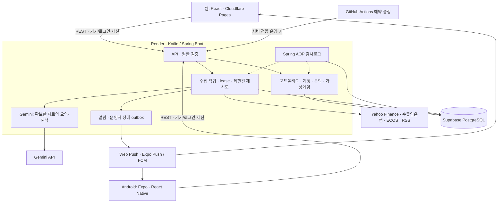

# FireWatch

**시장 자료와 개인 투자 기록을 연결하는 웹·Android 투자 점검 서비스.**

관심 기업의 가격·차트·뉴스·AI 분석 근거를 살펴보고, 직접 등록한 보유 자산의 비중과 집중·중복을 점검합니다. 가상투자 게임은 실제 투자 정보와 분리된 연습 메뉴입니다. 실제 주식 주문이나 증권사 자동 연동은 제공하지 않습니다.

[웹 서비스](https://firewatch-eqp.pages.dev) · [백엔드 API](https://firewatch-backend-q3cv.onrender.com/api/health) · [개발 포트폴리오 사례](docs/portfolio/firewatch-case-study.md) · [배포 안내](DEPLOY.md)

## 현재 상태

2026-10-08 기준, 기능 코드 `18cb55d`을 바탕으로 정리했습니다.

2026-10-09 후속으로 [BE-40 PR](https://github.com/huni2/FireWatch/pull/30)에서 KIND 공식 한국 상장법인2,651개의 회사명·업종 검색을 추가했습니다. 기존 편집 목록과 시세는 보존하며 가격을 생성하지 않습니다. [출처·범위·갱신 문서](docs/product/krx-company-directory/data-source.md)를 참고하세요. 서버·PostgreSQL·복원·웹/앱 CI 통과 후 웹·Render 배포를 확인했습니다. 공개 API에서 총2,669상품·새 기업의 한국어 검색·기존 분류·ETF·페이지 경계를 검증했습니다.

| 영역 | 상태 |
|---|---|
| 웹·백엔드 | Cloudflare Pages·Render에 배포. 운영 데이터는 Supabase PostgreSQL에 저장 |
| Google 로그인 | 웹 실제 로그인 성공 확인. 계정 연결·세션·연결 기기 관리 구현 |
| Android | Expo 기반 주요 기능과 빌드 설정 구현. 최신 APK의 로그인·푸시·삭제 등 실기기 검증과 Play 출시 준비 진행 중 |
| 디자인 | 기본 라이트 모드·오렌지 포인트, 선택형 웹 다크 모드. PC·모바일 반응형 개선 진행 중 |
| 운영 | 수집 실패 기록·제한된 재시도·운영자 진단 구현. 외부 금융 데이터 수집 장애의 실제 복구 확인은 남아 있음 |

구현, 배포, 실기기 검증은 서로 다른 단계로 관리합니다. 웹 배포가 기존 설치 APK를 갱신하지는 않습니다.

## 주요 기능

| 기능 | 사용자에게 제공하는 내용 |
|---|---|
| 개인 포트폴리오 | 회사·상품, 수량, 매입가, 현금을 직접 등록. 원금 비중·수집 시세 평가·분야/통화 노출·같은 ETF 지수명 중복 점검 |
| 내 기업 점검 | 관심 기업과 보유 주식을 모아 추천 근거·관련 기사·보유 맥락을 확인하고 가격/뉴스 화면으로 이동 |
| 기업 탐색 | 회사명 검색, 분야별 시작 목록, 개별 후보의 이유·위험·근거 기사, 가격·차트·뉴스 |
| 시장 자료·뉴스 | 장전 브리핑, 지수·환율·금·은·채권 자료, 날짜·키워드별 저장 뉴스 검색 |
| 투자 연습 | 시드 기반 가상 가격·지표·뉴스·픽, 주문 미리보기/총액/체결 기록, 보유 손익·compact 턴 응답/선택 상세 그래프·결과 설명 |
| 게임 순위 | 로그인 후 선택 등록·공개 닉네임 동의·철회, 주간 순위와 주간 우승 기록. 게임 내부에서만 제공 |
| 계정·지원 | Google 계정 연결, 관심·알림 설정, 문제 신고·의견, 공지와 첫 진입 안내 |
| 운영 관리 | 운영자 전용 감사로그·수집 진단·장애 알림. 일반 사용자의 운영 API 접근은 서버에서 제한 |

AI 분석은 참고 정보이며 수익이나 가격 변동 원인을 보장하지 않습니다. 구성 초안은 규칙 기반 예시입니다. [투자 정보 제공 범위](docs/product/investment-information-boundary.md)를 별도로 관리합니다.

## 아키텍처


```mermaid
flowchart TB
    WEB["웹: React · Cloudflare Pages"] -->|"REST · 기기/로그인 세션"| API
    APP["Android: Expo · React Native"] -->|"REST · 기기/로그인 세션"| API
    GHA["GitHub Actions 예약 폴링"] -->|"서버 전용 운영 키"| API
    subgraph SERVER["Render · Kotlin / Spring Boot"]
        API["API · 권한 검증"] --> DOMAIN["포트폴리오 · 계정 · 문의 · 가상게임"]
        API --> COLLECT["수집 작업 · lease · 제한된 재시도"]
        COLLECT --> AI["Gemini: 확보한 자료의 요약·해석"]
        COLLECT --> PUSH["알림 · 운영자 장애 outbox"]
        AUDIT["Spring AOP 감사로그"] -.-> DOMAIN
        AUDIT -.-> COLLECT
    end
    COLLECT --> SOURCES["Yahoo Finance · 수출입은행 · ECOS · RSS"]
    AI --> GEMINI["Gemini API"]
    DOMAIN --> DB[("Supabase PostgreSQL")]
    COLLECT --> DB
    AUDIT --> DB
    PUSH --> PROVIDERS["Web Push · Expo Push / FCM"]
    PROVIDERS --> WEB
    PROVIDERS --> APP
```

클라이언트가 DB에 직접 접근하지 않고 백엔드 API를 통해 조회·저장합니다. 게임은 외부 시세·뉴스·AI API를 호출하지 않는 가상 시뮬레이션으로 분리했습니다.

## 기술 스택과 선택

| 계층 | 현재 코드 기준 | 선택과 절충 |
|---|---|---|
| 백엔드 | Kotlin 2.3.21 · Java 21 · Spring Boot 4.1.0 | 도메인 검증·트랜잭션·스케줄러를 한 서비스에 구성. WebFlux/WebClient와 JPA/JDBC를 함께 사용하며 완전한 논블로킹 서버로 설명하지 않음 |
| 데이터 | PostgreSQL · JPA/JDBC · H2 | 운영 영속성과 로컬 개발을 분리. H2 테스트 외에 PostgreSQL 통합 검증 수행 |
| 웹 | React 18 · Vite 8 · TypeScript · Ant Design 5 | 기능별 화면, 라우트 지연 로딩, 공통 디자인 토큰과 반응형 레이아웃 |
| Android | Expo SDK 57 · React Native 0.86 · Expo Router · NativeWind | 웹과 API·도메인 계산·문구 공유. 네이티브 인증/푸시는 별도 설치 빌드로 검증 |
| 분석·알림 | Gemini · Web Push · Expo Notifications / FCM | 확보한 자료를 AI가 해석하고, 사용자/운영자 알림 경로를 구분 |
| 배포·검증 | Cloudflare Pages · Render · Supabase · GitHub Actions · EAS | 무료 사용 범위를 목표로 운영. 콜드스타트·외부 API 한도·빌드 대기 등의 제약을 수용 |

OpenSearch는 비용과 운영 부담으로 보류했습니다. 종목 검색은 PostgreSQL 기반 카탈로그와 외부 검색 경로를 사용하며, 전 시장 자체 검색엔진을 완성했다고 주장하지 않습니다.

## 백엔드에서 해결한 문제

| 문제 | 적용한 해결 | 코드·근거 |
|---|---|---|
| 컨테이너 재배포 후 기록 유실 | 운영 저장소를 외부 PostgreSQL로 분리하고 기존 자료를 보존하는 수집 경로 구성 | [운영 DB 전환 결정](llm-wiki/Decisions/0009-persistent-db-supabase.md) |
| 중복 수집·실패 무한 반복 | DB 작업 lease, KST 날짜/종류별 실패 한도, 30~60분 재시도 간격, 장애 기록과 운영자 알림 | [CollectionJobRunner](backend/src/main/kotlin/com/firewatch/backend/service/CollectionJobRunner.kt) |
| Supabase session pooler 연결 한도 초과 | 인스턴스당 최대 연결 3개·유휴 0개로 축소, 배포 중 중첩 연결 예산 고려 | [운영 DB 설정](backend/src/main/resources/application-prod.yml) |
| 포트폴리오 동시 편집 충돌 | 버전 확인·변경 이력 저장, 오래된 저장 요청 거절, 미저장 입력 보호 | [PortfolioService](backend/src/main/kotlin/com/firewatch/backend/service/PortfolioService.kt) |
| 주문 중복·장부 불일치 | 요청 ID 재사용 처리, 게임 행 잠금, 서버 계산으로 거래·평가·순위 일관성 유지 | [GameService](backend/src/main/kotlin/com/firewatch/backend/service/GameService.kt) |
| 공개 클라이언트 키로 운영 API 접근 | 서버 전용 키와 검증된 운영자 로그인 세션으로 분리. 이메일 표시만으로 권한 부여하지 않음 | [OperatorAccess](backend/src/main/kotlin/com/firewatch/backend/service/OperatorAccess.kt) |
| 근거 없는 AI 후보 노출 | 저장 기사와 연결이 확인된 후보를 노출하고 이유·위험·자료 시각을 함께 표시 | [기업 탐색 도메인](shared/discovery.ts) |

문제의 배경·판단·검증·남은 한계는 [포트폴리오 사례 문서](docs/portfolio/firewatch-case-study.md)에 정리했습니다.

## 상태 관리와 검증

서버가 저장 기록과 거래 장부의 기준입니다. 웹은 기능별 훅과 로컬 상태로 조회·편집·처리 중·실패를 관리하며, 모바일은 같은 API 계약을 사용합니다. 전역 서버 캐시 라이브러리는 아직 도입하지 않았습니다. 검색 결과와 조건의 일치, 요청 경쟁, 중복 조회는 계속 점검할 항목입니다.

[CI 워크플로](.github/workflows/validate.yml)는 백엔드 테스트, PostgreSQL 동시성·카탈로그/합성3,000건·문의·게임 순위 통합 검사 및 별도 DB 백업 복원/행 서명/시퀀스 대조, 웹 lint/build, 모바일 lint/타입 검사와 출시 설정 검사 테스트를 수행합니다. 기능 코드 `18cb55d`의 [main CI](https://github.com/huni2/FireWatch/actions/runs/37704342437)는 성공했습니다. 이 결과가 실제 기기 푸시 수신이나 현재 외부 수집 성공을 증명하지는 않습니다.

## 로컬 실행

Java 21과 Node.js 22를 준비합니다. 각 명령은 해당 디렉터리에서 실행합니다.

```powershell
# backend/ — 기본 개발 프로필은 H2, 기본 포트 8080
.\gradlew.bat bootRun

# web/ — web/.env.example을 참고해 .env 구성
npm ci
npm run dev

# mobile/ — mobile/.env.example을 참고해 환경 구성
npm ci
npx expo start
```

```powershell
# backend/
.\gradlew.bat test
# web/
npm run lint
npm run build
# mobile/
npm run lint
npx tsc --noEmit
node --test scripts/release-check.test.cjs
```

외부 API 키가 없는 로컬 환경에서는 실제 분석·푸시 기능을 모두 검증할 수 없습니다. Google 로그인·Android 원격 푸시는 Expo Go 확인과 설치 APK 검증을 구분합니다.

## 문서와 출시 전 과제

- [개발 포트폴리오 사례·소개 문구](docs/portfolio/firewatch-case-study.md)
- [배포·환경변수·운영 점검](DEPLOY.md)
- [자료 보관·백업·복구 절차](docs/deployment/data-preservation.md) · [출시 기능 범위](docs/product/release-scope.md)
- [Android 개발 안내](mobile/README.md) · [Play 제출 안내](mobile/PLAY_STORE.md) · [실기기 검증](docs/deployment/android-release-check.md)
- [프로덕트 문서](docs/product/) · [기존 디자인·기능 리뷰](docs/reviews/)
- [현재 맥락](llm-wiki/Context.md) · [열린 과제](llm-wiki/Next-Tasks.md) · [설계 결정](llm-wiki/Decisions/) · [작업 로그](llm-wiki/log.md)

남은 핵심 작업은 최신 Android 설치 검증, 금융 데이터 수집 복구 확인, 개인정보·투자 정보 범위와 Play 제출 항목 확인입니다. 게임은 실제 기업 이름 26개를 사용하는 단일 규칙·단일 순위로 구현했으며 Render 반영 확인이 남았습니다. 가격·뉴스·지표·픽은 전부 가상 자료이고 검색·분야·6개씩 보기를 제공합니다. 이전 시험 기록은 보관하며 출시 후 시즌은 추후 과제입니다. 분야별 시작 목록과 ETF 비교도 전체 상장 종목·상품 데이터베이스는 아닙니다.

개발 과정에서는 Claude Code와 Codex를 활용했습니다. 요구사항·기술 결정·실패와 검증 결과를 코드와 함께 기록하며, AI 생성 결과는 테스트와 운영 확인으로 검토합니다. 도구가 생성한 코드와 사람이 내린 제품·운영 판단을 구분해 설명합니다.
