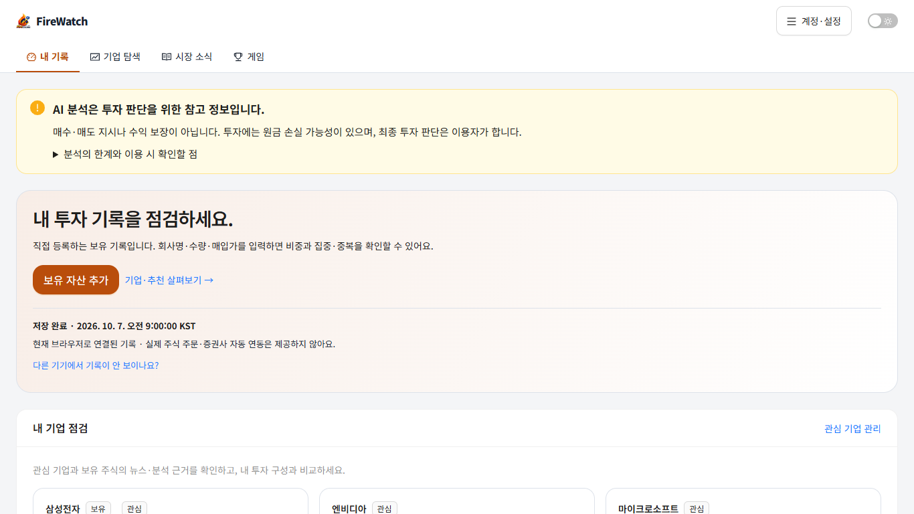
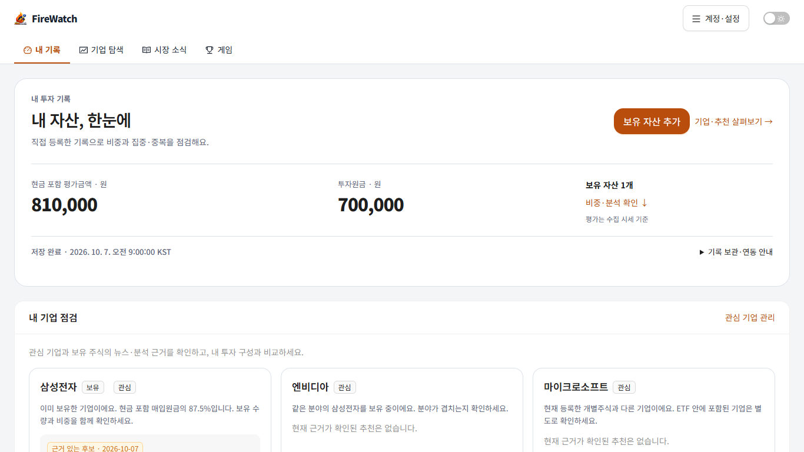
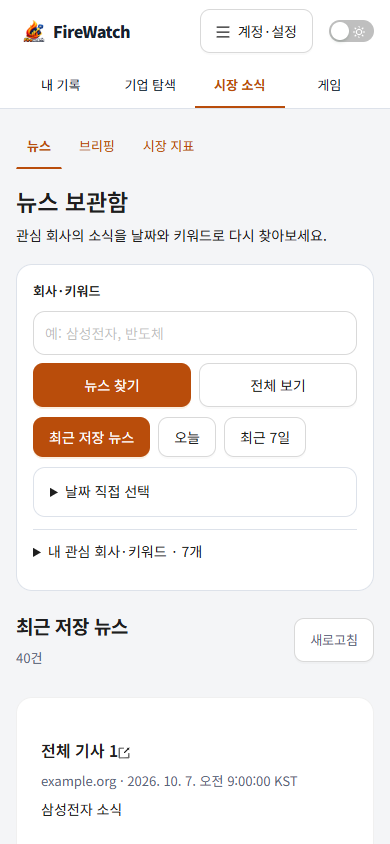
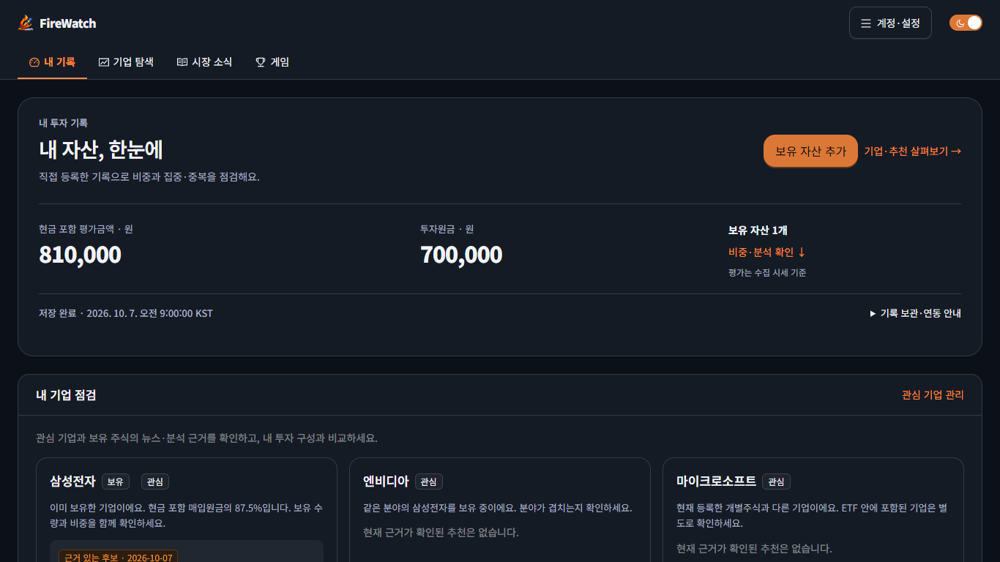

# FireWatch 출시 전 기능·UI/UX 점검

점검일: 2026-10-08 · 과제: WEB-26 · 대상: 웹 홈/기업 탐색/뉴스/계정/게임

## 이번 수정의 기준

FireWatch는 관심 기업의 자료·추천 근거를 개인 보유 기록과 연결하는 투자 점검 서비스다. 추천 이유와 내 보유 비중을 함께 보는 경험을 먼저 드러낸다. 독점 기능이나 검증된 사용자 아하 모멘트라고 표현하지 않는다. 가상게임은 별도 연습 메뉴로 유지한다.

종목 정보는 [토스증권](https://www.tossinvest.com/), 포트폴리오 분석은 [Portfolio Performance](https://www.portfolio-performance.info/en/), 가상 거래는 [TradingView](https://www.tradingview.com/support/solutions/43000516466-paper-trading-main-functionality/)에도 있다. 공식 소개를 비교한 결과, 기능 개수보다 자료·근거·내 기록을 이해하기 쉬운 순서로 연결하는 방향을 택했다. 경쟁 서비스에 해당 연결이 전혀 없다는 주장은 하지 않는다.

## 발견한 문제와 적용 결과

| 우선순위 | 문제 | 수정과 확인 |
|---|---|---|
| P1 | 뉴스 조건을 바꾸고 조회가 실패하면 이전 응답이 새 조건의 결과처럼 남을 수 있음 | 응답에 요청 조건 키를 연결해 불일치 응답을 숨김. 같은 조건 새로고침 실패에는 이전 결과임을 명시 |
| P1 | 뉴스 검색이 주소/뒤로 가기와 분리돼 회사·날짜·페이지를 재현하기 어려움 | URL을 적용 조건으로 사용. 검색·기간·관심 키워드·페이지와 뒤로 가기 복원 검사 |
| P1 | 포트폴리오 재조회 실패 시 편집 화면 전체를 오류 화면으로 바꿀 수 있음 | 이미 있는 편집값을 유지하고 오류를 위에 표시. 저장409 뒤 조회404에서도 수량/매입가 유지·취소 복원 확인 |
| P2 | 홈 첫 화면의 큰 위험 안내·소개·연동 설명 때문에 실제 자산 정보가 밀림 | 평가금액/투자원금/보유 수를 첫 영역에 배치. 저장 상태는 유지하고 보관 설명만 접음 |
| P2 | 추천과 내 보유의 연결이 상세 진입 후에야 나타남 | 확인 가능한 기업의 후보 카드에 보유/분야 비교와 내 비중 점검 링크 추가. 포트폴리오가 없을 때 보유 여부를 단정하지 않음 |
| P2 | 뉴스 검색 버튼·기간·키워드가 겹치고 기사 제목을 보기까지 공간이 큼 | 검색 필드/행동 정렬, 관심 키워드 접기, 반복 결과 제목 제거, 모바일 간격 조정 |
| P2 | 로그인 CTA 앞의 긴 연동 설명 | 연결 목적 → 공식 Google 버튼 → 보관 안내 순서. 상세 충돌 설명은 펼쳐보기로 유지 |
| P2 | 안내가 실제 오류 알림과 같은 큰 경고 상자이고 링크 색이 불일치 | 반복 투자 안내를 작은 정보 영역으로 정리. 핵심 원금 손실/수익 미보장 문구는 계속 표시. 링크를 테마 오렌지로 통일 |
| P2 | 회사 검색 입력에 명확한 접근성 이름이 없음 | 회사·상품 이름 검색 aria-label 추가. 첫 자산의 키보드 선택 확인 |

## 디자인 관점

**좋아진 점:** 숫자와 행동을 먼저 보는 계층, 회사명 중심 탐색, 후보 옆 보유 맥락, 흰 표면/회색 바탕/오렌지 행동의 일관성. 설명을 접어도 저장 상태·가격 기준·위험·기사 출처는 남긴다. 뉴스 목록은 반복 카드 제목보다 기사 읽기를 우선한다.

**남는 아쉬움:** 공통 UI가 Ant Design 카드 중심이고, 긴 기업 근거/보유 맥락은 모바일에서 여전히 스크롤이 필요하다. 카탈로그 시작 목록과 가상 기업5개는 정보량의 제약이다. 가입/실제 주문 자동 연동이 없어 사용자가 첫 기록을 직접 입력해야 한다.

**후속 판단:** 컴포넌트 수를 늘리기보다 실제 첫 이용자의 자산 등록·추천 비교·관련 기사 도달을 관찰한다. 이번 테스트에서 확인한 화면 노출은 사용자 만족도 개선이나 아하 모멘트 검증을 뜻하지 않는다.

## 기능·화면 검증

- 홈/기업 탐색/뉴스/계정과 빈 홈: 1366·1920·390·360px, 라이트20화면. 가로 넘침·페이지 JS 오류·운영 시험 쓰기0건.
- 웹 선택형 다크: 홈/뉴스/기업 탐색/계정 1366px. 저장된 테마·가로 넘침 확인 및 이미지 검토.
- 뉴스: 다른 조건 실패 시 과거 기사 숨김, 느린 이전 요청 뒤 빠른 새 요청, 뒤로 가기/페이지, 잘못된 날짜의 API 무호출, 같은 조건 재조회 실패 표시. 390×844 첫 기사 시작 y≈722px인 fixture 확인.
- 포트폴리오: 저장하지 않는 예시, 첫 입력·회사 키보드 선택, 저장409/재조회404의 미저장 값 보존, 편집 취소. 저장 요청은 테스트 대체 API에1건, 실제 운영 저장0건.
- 기업 점검: 근거 없는 후보 제외·기사 연결·6개 페이지·가격/뉴스 이동·빈/실패 상태.
- 계정: 일반/운영자/무효/충돌/만료/SDK 실패, 연결 기기와 해제·로그아웃 실패/성공 보존을 fixture로 검사.
- 게임: 1280×720·1366×768·1440×900·1536×864·1920×1080 주문 영역 고정/다음 턴 노출, 모바일·다크·종료 상태, 주문 초기화/장부 보존·픽 재선택·매수/턴 회귀. 실제 금융 API 호출 없이 테스트.
- 수집 진단: 일반 사용자 초기/직접 화면 비노출·자동 조회0, 운영자 직접 펼침/재조회/접기. 장애 기록 삭제 없음.
- 웹 build 통과, lint 오류0. 기존 SettingsPage/useWebPushSubscription의 effect 경고2개는 남아 있다.

이 검사들은 브라우저가 실제 웹 번들을 실행하되 API 응답을 테스트 데이터로 대체한 검사다. Android 설치, 실제 Google 자격증명 재인증, 푸시 실수신, 현재 금융 제공처의 수집 성공을 포함하지 않는다. 해당 항목은 APP-21/WEB-19/BE-30으로 관리한다.

## 과제 관리 정정

작업 중 사용자 요청에 따라 Next-Tasks를 점검했다. 열린 항목28개 중 완료된 개발/배포와 중복된 모바일 설치 확인을 정리해8개로 줄였다. 구현 종료와 실기기 완료를 혼동하지 않고 모든 설치 확인을 APP-21에 보존했다. 목록 정리 커밋은 f1d7d23이다.

## 화면 비교

아래는 API를 테스트 데이터로 대체한 화면이다. 삼성전자 보유 수량·금액·기사·추천 문구는 예시이며 운영 사용자의 데이터나 실제 추천 성과가 아니다. 변경 후 홈/다크는 배포 웹 번들 촬영, 모바일 뉴스는 배포 번들의 검색 fixture다.

### 홈 변경 전 · 1366×768

### 홈 변경 후 · 1366×768

### 모바일 뉴스 · 390×844

### 선택형 다크 · 1366×768

## 배포 확인

기능 커밋79cd12f, Cloudflare Pages37f8979d를 공개 배포했다. GitHub push가 일시적으로 Internal Server Error를 반환했으나 재시도 후 branch/main 업로드가 성공했다. 공개 번들에서도 라이트20/다크4화면·뉴스 요청 경쟁/URL 복원/오류·수집 진단 비노출 검증을 통과했다. 실제 운영 시험 쓰기0, 페이지 오류/가로 넘침0. 백엔드/DB 변경은 없다.

[main CI37658863371](https://github.com/huni2/FireWatch/actions/runs/37658863371)가 성공했다. 백엔드 테스트와 실제 PostgreSQL 통합 검사, 웹 lint/build, 모바일 lint/타입/출시 설정 검사가 통과했다. WEB-26을 종료 기록으로 옮겨 열린 과제는7개가 됐다. Android 설치·외부 수집 복구의 확인 범위는 확대하지 않는다.
